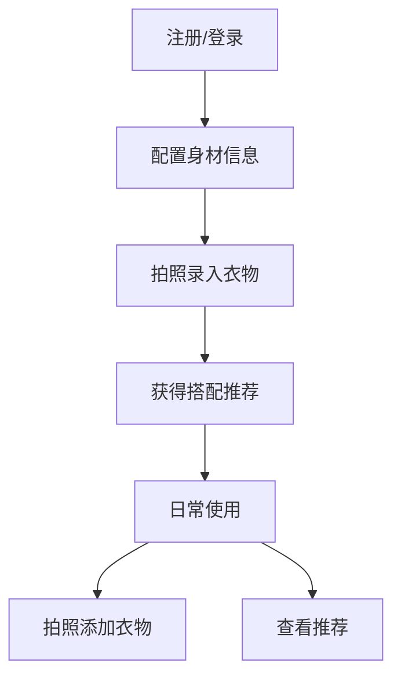

## 1. 产品概述
智能衣橱管理应用，通过拍照标记快速录入衣物，基于身材特征提供高效搭配推荐。
解决用户"衣物录入繁琐、搭配选择困难"的痛点，让穿搭变得更简单高效。

## 2. 核心功能

### 2.1 用户角色
| 角色 | 注册方式 | 核心权限 |
|------|----------|----------|
| 普通用户 | 邮箱/手机号注册 | 衣物录入、搭配查看、基础推荐 |

### 2.2 功能模块
MVP版本包含以下核心页面：
1. **快速录入**: 拍照+标记方式添加衣物，简化录入流程
2. **身材配置**: 输入身高三维数据，从预设身材图片中选择最匹配项
3. **高效推荐**: 一键生成搭配方案，专注效率而非复杂功能

### 2.3 页面详情
| 页面名称 | 模块名称 | 功能描述 |
|-----------|-------------|-------------|
| 快速录入 | 拍照功能 | 调用相机拍摄衣物照片，支持多张拍摄 |
| 快速录入 | 标记分类 | 通过简单点击标记衣物类型（上装/下装/外套/鞋子） |
| 快速录入 | 基础属性 | 快速选择颜色、季节（通过图标化界面） |
| 身材配置 | 数据输入 | 输入身高、体重、胸围、腰围、臀围等基础数据 |
| 身材配置 | 预设选择 | 展示5-6种典型身材类型图片，用户选择最匹配项 |
| 高效推荐 | 一键推荐 | 基于现有衣物立即生成3-5套搭配方案 |
| 高效推荐 | 快速筛选 | 按场合（工作/休闲/正式）快速筛选推荐 |

## 3. 核心流程
用户首次使用流程：注册登录 → 配置身材信息 → 拍照录入几件基础衣物 → 获得推荐

日常用户使用流程：拍照添加新衣物 → 查看今日推荐 → 选择场合获取推荐

## 4. 用户界面设计

### 4.1 设计风格
- **主色调**: 清爽白色 (#FFFFFF) + 点缀蓝色 (#4A90E2)
- **按钮风格**: 大圆角按钮，醒目易点击
- **字体**: 系统默认字体，标题16px，正文14px
- **布局风格**: 全屏卡片式，减少视觉干扰
- **图标风格**: 简约面性图标，直观易懂

### 4.2 页面设计概览
| 页面名称 | 模块名称 | UI元素 |
|-----------|-------------|-------------|
| 快速录入 | 相机界面 | 全屏相机视图，底部大拍照按钮，简单标记工具栏 |
| 身材配置 | 数据表单 | 清晰输入框分组，滑块选择体型，预设图片网格展示 |
| 高效推荐 | 推荐列表 | 大图展示搭配效果，左右滑动切换，底部场合选择器 |

### 4.3 响应式设计
移动端优先设计，确保拍照和标记功能在手机上的最佳体验。

## 5. MVP功能优先级
1. 用户注册登录
2. 拍照+标记衣物录入
3. 身材数据输入+预设选择
4. 基础推荐算法
5. 简单推荐结果展示