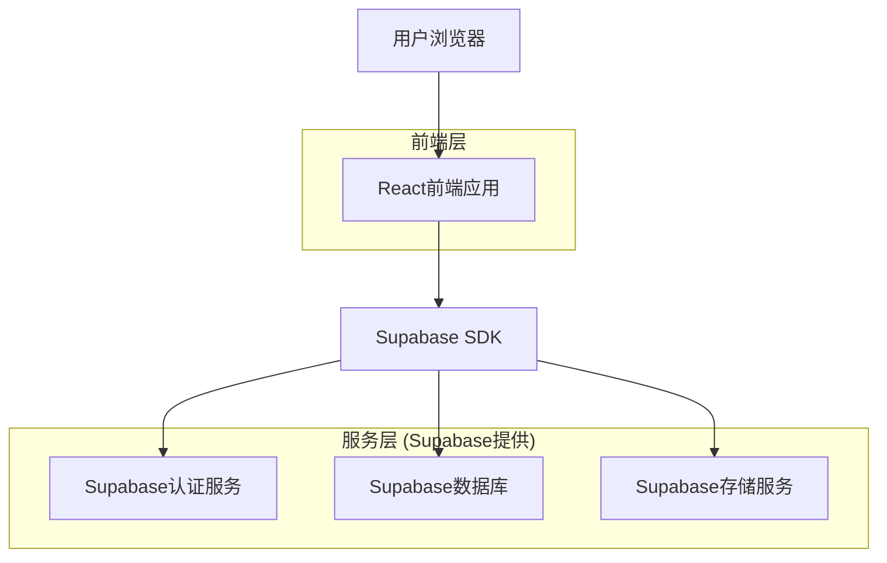
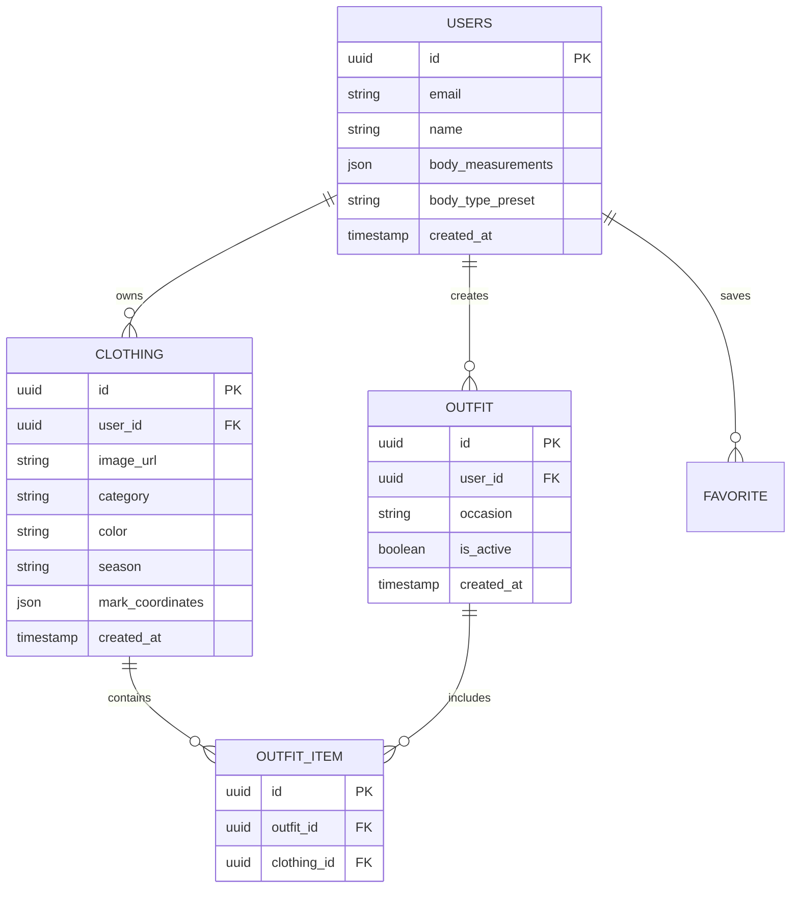

## 1. 架构设计



## 2. 技术栈描述

* **前端**: React18 + TailwindCSS3 + Vite

* **初始化工具**: vite-init

* **后端**: Supabase (提供认证、数据库、存储服务)

* **图片处理**: 浏览器端拍照、标记、压缩和预览

* **相机功能**: 浏览器原生 Camera API + Canvas 标记

## 3. 路由定义

| 路由               | 用途        |
| ---------------- | --------- |
| /                | 快速录入页面，拍照标记衣物 |
| /body-profile    | 身材配置页面，输入数据选择预设 |
| /recommendations | 高效推荐页面，一键生成搭配 |
| /login           | 登录页面      |
| /register        | 注册页面      |

## 4. 数据模型

### 4.1 数据模型定义



### 4.2 数据定义语言

用户表 (users)

```sql
-- 创建用户表
CREATE TABLE users (
  id UUID PRIMARY KEY DEFAULT gen_random_uuid(),
  email VARCHAR(255) UNIQUE NOT NULL,
  name VARCHAR(100) NOT NULL,
  body_measurements JSONB DEFAULT '{}',
  body_type_preset VARCHAR(50),
  created_at TIMESTAMP WITH TIME ZONE DEFAULT NOW(),
  updated_at TIMESTAMP WITH TIME ZONE DEFAULT NOW()
);

-- 创建衣物表
CREATE TABLE clothing (
  id UUID PRIMARY KEY DEFAULT gen_random_uuid(),
  user_id UUID REFERENCES users(id) ON DELETE CASCADE,
  image_url TEXT NOT NULL,
  category VARCHAR(50) NOT NULL,
  color VARCHAR(30) NOT NULL,
  season VARCHAR(20) NOT NULL,
  mark_coordinates JSONB DEFAULT '{}',
  created_at TIMESTAMP WITH TIME ZONE DEFAULT NOW(),
  updated_at TIMESTAMP WITH TIME ZONE DEFAULT NOW()
);

-- 创建搭配表
CREATE TABLE outfits (
  id UUID PRIMARY KEY DEFAULT gen_random_uuid(),
  user_id UUID REFERENCES users(id) ON DELETE CASCADE,
  occasion VARCHAR(50) NOT NULL,
  is_active BOOLEAN DEFAULT TRUE,
  created_at TIMESTAMP WITH TIME ZONE DEFAULT NOW()
);

-- 创建搭配项目表
CREATE TABLE outfit_items (
  id UUID PRIMARY KEY DEFAULT gen_random_uuid(),
  outfit_id UUID REFERENCES outfits(id) ON DELETE CASCADE,
  clothing_id UUID REFERENCES clothing(id) ON DELETE CASCADE
);

-- 设置权限
GRANT SELECT ON users TO anon;
GRANT ALL PRIVILEGES ON users TO authenticated;
GRANT SELECT ON clothing TO anon;
GRANT ALL PRIVILEGES ON clothing TO authenticated;
GRANT SELECT ON outfits TO anon;
GRANT ALL PRIVILEGES ON outfits TO authenticated;
GRANT SELECT ON outfit_items TO anon;
GRANT ALL PRIVILEGES ON outfit_items TO authenticated;
```

## 5. 推荐算法设计

### 基础推荐逻辑

1. **场合筛选**: 根据用户选择的场合（工作/休闲/正式）筛选衣物
2. **颜色基础搭配**: 应用简单的颜色协调规则（同色系、对比色）
3. **身材匹配**: 基于用户选择的身材预设推荐合适版型

### 推荐流程

```
输入: 用户ID, 场合
处理:
  1. 获取用户所有衣物
  2. 按场合筛选衣物
  3. 应用基础颜色搭配规则
  4. 生成3-5套简单搭配方案
输出: 推荐搭配列表
```

## 6. 开发计划

### 第一阶段 (MVP核心功能)

* [ ] 用户注册登录系统

* [ ] 拍照+标记衣物录入功能

* [ ] 身材数据输入+预设选择

* [ ] 基础推荐算法

* [ ] 简单推荐结果展示

### MVP完成标准

* 用户可通过拍照+标记快速录入5-10件衣物
* 身材配置支持数据输入和预设图片选择
* 推荐系统能为每个场合生成3-5套搭配方案
* 整体流程可在5分钟内完成首次使用

